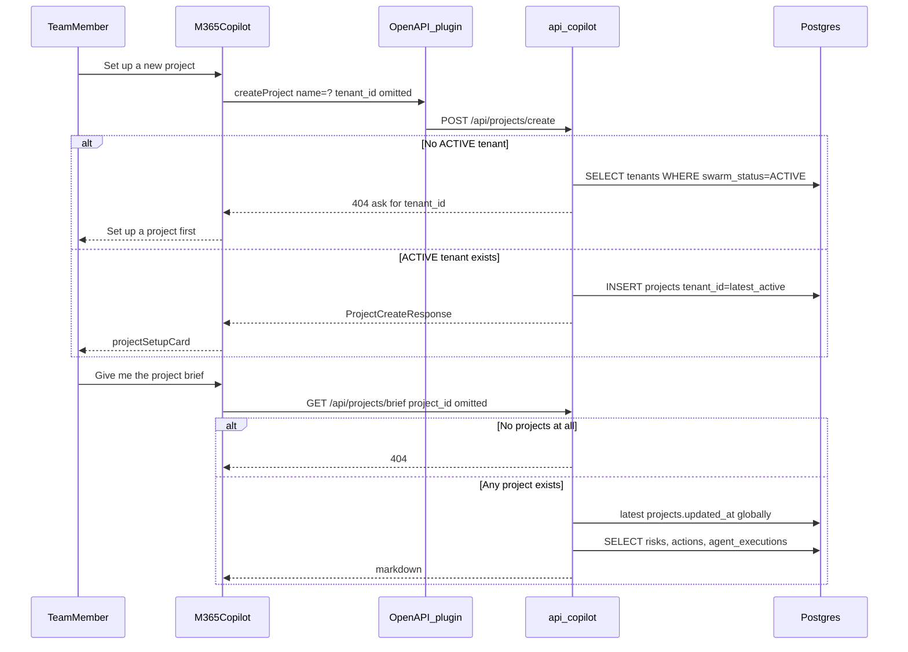

# GIABO Digital PMO — Architecture Summary & Operational Gap Analysis

**Date:** 2026-09-25  
**Scope:** M365 Copilot / Teams human-team loop, and the nil-sign-up / 100% token-use billing model.  
**Sources:** `api/copilot.py`, `appPackage/*`, `api/bot.py`, `app_graph.py`, `core/billing.py`, `api/marketplace.py`, `db/schema.sql`, `db/models.py`, `core/workflow.py`.

This is an audit of what the repository actually does today versus the product story of “a team member opens Copilot, starts chatting with no signup, and every token is attributed and gated against the right tenant.”

---

## 1. Executive snapshot

The product is **two disconnected surfaces**, not one loop:

| Surface | Entry | Backend | Spend | Tenant identity |
|---|---|---|---|---|
| **M365 Copilot Declarative Agent** | Conversation starters in Copilot | `api/copilot.py` OpenAPI plugin (`auth: None`) | Microsoft-hosted Copilot tokens (not ours) | Optional UUIDs; else “latest ACTIVE tenant / latest project” |
| **Teams Bot Framework bot** | Chat with the bot / Adaptive Cards | `api/bot.py` → `app_graph.py` MAF graph | Our Azure OpenAI deployments | `conversation.id` as `project_id`; `billing_status="active_trial"` hardcoded |

**Billing gates exist and are correct on paper** (`core/billing.py`: `assert_pilot_feature_access` → `check_pilot_project_limit` → `check_pilot_compute_cap` → `check_credit_balance`). **No production call site invokes `run_billing_gates`.** No production path inserts `token_ledger` or `agent_executions`. Copilot create/brief/usage never touch those tables except as reads.

**Nil sign-up is not implemented.** A tenant row can only be created by the Azure Marketplace landing page / webhook (`api/marketplace.py`). Copilot’s “omit the ID” fallback **requires an already-ACTIVE tenant**. An empty database, or a brand-new user with no Marketplace subscription, gets HTTP 404 — not a provisioned trial.

**Auto-resolution is global, not caller-scoped.** `_resolve_default_tenant` / `_resolve_default_project` pick the newest row in the whole database. That attributes create/brief/usage (and, if gates were wired, token spend) to whoever last touched the system — not the person in the chat.

---

## 2. System map

```mermaid
flowchart TB
  subgraph copilotLoop [Copilot Declarative Agent]
    starter[Conversation starter]
    da[declarativeAgent.json]
    plugin[ai-plugin.json OpenAPI auth None]
    copilotApi[api/copilot.py]
    pg[(Azure Postgres)]
    starter --> da --> plugin --> copilotApi --> pg
  end

  subgraph teamsLoop [Teams Bot Framework]
    teamsMsg[Teams message activity]
    bot[api/bot.py]
    graph[app_graph.py MAF]
    aoai[Azure OpenAI]
    teamsMsg --> bot --> graph --> aoai
    graph --> pg
  end

  subgraph marketplace [Marketplace only tenant factory]
    landing["GET /marketplace/landing"]
    webhook["POST /api/marketplace/webhook"]
    landing --> pg
    webhook --> pg
  end

  subgraph unused [Designed but unwired]
    gates[core/billing.py run_billing_gates]
    ledger[token_ledger]
    execs[agent_executions]
  end
```

The SharePoint RAID graph (`core/workflow.py` + `SwarmState`) is a third surface. It imports `AGENT_REGISTRY` but does **not** call `run_billing_gates` either.

---

## 3. The M365 Copilot human-team interaction loop

### 3.1 What a team member sees today

The Teams app package (`appPackage/manifest.json`) registers a **declarative agent**, not the Bot Framework bot, as the Copilot surface:

- Agent name: **GIABO Digital PMO** (`appPackage/declarativeAgent.json`)
- Conversation starters:
  1. “Set up a new project”
  2. “Give me the project brief”
  3. “Check my usage and billing tier”
- Instructions forbid asking the user for a raw `tenant_id` / `project_id`. The agent is told to call the plugin immediately and, on 404, “tell the user plainly and suggest they set up a project first.”

The plugin (`appPackage/ai-plugin.json`) exposes three functions over OpenAPI with **`auth.type: None`**:

| Function | HTTP | Purpose |
|---|---|---|
| `createProject` | `POST /api/projects/create` | Insert a `projects` row; Adaptive Card `projectSetupCard.json` |
| `getProjectBrief` | `GET /api/projects/brief` | Markdown of open risks, open actions, last 10 `agent_executions` |
| `getUsageTelemetry` | `GET /api/usage/telemetry` | Plan tier, swarm status, project count, `raw_token_spend_usd` vs allowance |

The card’s **View Governance Brief** button is `Action.Execute` with `verb: getProjectBrief` and `data.project_id = ${id}` — the one place Copilot *does* pass a real project UUID.

This loop **does not** enter `api/bot.py`, `app_graph.py`, the event bus, PM Veto, or any specialist worker. A Copilot user cannot log progress, draft a baseline change, or raise a RAID risk through the declarative agent. Those live only on the Teams bot graph.

### 3.2 End-to-end data flow



**Create (`POST /api/projects/create`)**

1. Body accepts snake_case or camelCase (`projectName`, `sharepointUrl`, …).
2. Empty `name` → **422**.
3. Explicit `tenant_id` missing in DB → **404**.
4. Omitted `tenant_id` → `_resolve_default_tenant`: newest `tenants.updated_at` where `swarm_status = ACTIVE`.
5. No ACTIVE tenant → **404** with detail that tells the *model* to ask for a `tenant_id` (contradicts agent instructions).
6. Inserts `projects` with `status=new`. Does **not** call `check_pilot_project_limit`. Does **not** start SharePoint sync, Outlook poll, or a swarm run. Does **not** write `agent_executions` / `token_ledger`.

**Brief (`GET /api/projects/brief`)**

1. Optional `project_id` or `projectId`.
2. Omitted → newest `projects.updated_at` **across all tenants**.
3. Reads up to 20 `pmo_artifacts` of type `risk` and `action`, plus 10 `agent_executions`.
4. Production Teams/Copilot paths never insert `agent_executions`, so the audit log is almost always “_No agent activity recorded yet._”
5. Brief does not include baselines, tasks, event_bus, or document_cache.

**Usage (`GET /api/usage/telemetry`)**

1. Same tenant fallback as create.
2. Reports `tenants.raw_token_spend_usd`, generated `monthly_token_allowance_usd` ($20 trial / $350 paid), `billed_overage_usd`, `is_overage = spend > allowance`.
3. Those spend columns are only mutated by `check_pilot_compute_cap` — which is never called — so telemetry is **$0.00 forever** unless someone wrote the row by hand.

### 3.3 Friction points and missing error states

| # | Symptom | Why |
|---|---|---|
| F1 | Starter “Set up a new project” has **no project name** | `createProject` requires `name`. Agent must invent a name or ask. Not specified in instructions. |
| F2 | First-ever user, empty DB | Create 404s. Agent says “set up a project first,” but create itself needs an ACTIVE tenant. **Chicken-and-egg.** No “provision my trial” action. |
| F3 | Marketplace tenant still `PROVISIONING` | `_resolve_default_tenant` excludes it. User bought the offer but cannot create a project until `Subscribed` / `ACTIVE`. No Copilot error copy for this state. |
| F4 | Explicit unknown UUID | 404 is correct. OpenAPI documents it. Agent handles it. |
| F5 | Brief with zero projects | 404. Reasonable. |
| F6 | Brief after create via card | `Action.Execute` passes `project_id`. This path is sound **if** the plugin runtime forwards `data`. If it does not, brief falls back to “latest project globally.” |
| F7 | Cross-tenant default | User A’s “give me the brief” can return User B’s newest project. No Entra identity on the request (`auth: None`). |
| F8 | Create bypasses the 1-project free-trial cap | `PILOT_PROJECT_LIMITS[FREE_TRIAL] = 1` is never consulted. A trial tenant can accumulate unlimited Copilot-created projects. |
| F9 | Suspended / cancelled tenant | If someone passes that tenant’s UUID explicitly, create **succeeds**. Only the omit-ID path filters `ACTIVE`. Usage then reports `swarm_status=suspended` but still 200. |
| F10 | No 409 / conflict | Duplicate project names are allowed. No SharePoint-site uniqueness check beyond `(tenant_id, sharepoint_site_id)` if both are set. |
| F11 | Copilot spend is invisible | Function-calling tokens are Microsoft’s. Our Azure OpenAI meter is unused on this surface. “Check my usage” cannot reflect Copilot chat cost. |
| F12 | Two products, one package | Sideloading the app gives Copilot the declarative agent. The Bot Framework bot (`/api/messages`) is a different conversation with different state (`MemoryStorage`, lost on restart) and a different `project_id` (`conversation.id`). A team that “sets up a project” in Copilot does **not** attach the Teams bot graph to that row. |
| F13 | CORS is wide open | `allow_origins=["*"]` plus `auth: None` means anyone who can reach the Azure hostname can create projects on the latest ACTIVE tenant. |

---

## 4. The nil-sign-up & 100% token-use billing model

### 4.1 How the model is designed

From `db/schema.sql` and `core/billing.py`:

1. **One `tenants` row per Azure Marketplace SaaS subscription.** `plan_tier` is `free_trial` ($20 / 14 days) or `paid_monthly` ($350 / month, 3× overage). `swarm_status` is the circuit breaker (`provisioning`, `active`, `trial_expired`, `suspended`, `cancelled`).
2. **`token_ledger`** is the per-call audit: prompt/completion tokens, raw cost, overage multiplier, Marketplace metering emission flags.
3. **`agent_executions`** is the per-node audit the Copilot brief claims to show.
4. **Four sequential gates** before any Azure OpenAI call:
   1. `assert_pilot_feature_access` — Standard-tier agents (`risk_radar_monitor`, `scrum_master_liaison`) denied on `free_trial`.
   2. `check_pilot_project_limit` — trial: 1 project; paid: 25. Fail if `count > limit`.
   3. `check_pilot_compute_cap` — `SELECT … FOR UPDATE` on the tenant; reserve `estimated_cost_usd` onto `raw_token_spend_usd`; trial hard-halts to `TRIAL_EXPIRED` on date or $20; paid flips 3× overage after $350.
   4. `check_credit_balance` — halt if `trial_expired` / `suspended` / `cancelled`.
5. **Marketplace webhook** is supposed to keep `plan_tier` / `swarm_status` in sync so those gates see Microsoft’s real subscription state.

“Nil sign-up” in Copilot docs (`api/copilot.py` header) means: **do not ask the chat user for UUIDs**; default to the latest active tenant/project. It is **not** “create a tenant from thin air when a stranger opens Copilot.”

“100% token-use” in the schema means: **every LLM call is reserved, reconciled, and (for paid) metered**. That is the `token_ledger` + `check_pilot_compute_cap` contract.

### 4.2 How users actually start chatting with zero setup

There is **no path** that creates a `tenants` row from Copilot or the Teams bot.

| Path | Creates tenant? | Result for a new user |
|---|---|---|
| Copilot `createProject` | No — requires existing ACTIVE tenant | 404 |
| Copilot brief / usage | No | 404 |
| Teams `PMOBot._load_pmo_state` | No — in-memory `PMOState` only | Chat proceeds with `project_id=conversation.id`, `billing_status="active_trial"` |
| `GET /marketplace/landing` | Yes | Only after Azure Marketplace purchase + token redeem |
| Marketplace webhook | Yes / update | Only after Microsoft subscription events |

So the nil-sign-up **chat** experience and the **billing** identity are inverted:

- Copilot: identity-first (must already have a tenant), chat-second. Fails closed with 404.
- Teams bot: chat-first (always works), identity-never. Spends our Azure OpenAI budget with **no tenant row**, **no reservation**, **no halt** except a local string on `PMOState`.

### 4.3 Auto-resolution vs Phase 2 gates

`_resolve_default_tenant` (ACTIVE, newest `updated_at`) and `_resolve_default_project` (any project, newest `updated_at`) **do not** call:

- `assert_pilot_feature_access`
- `check_pilot_project_limit`
- `check_credit_balance`
- `check_pilot_compute_cap`

They also do not write `token_ledger`.

If gates *were* later wired to “whatever ID the Copilot resolver returned,” attribution would still be wrong:

1. **Wrong tenant.** Latest ACTIVE tenant in a shared SaaS database is not “this user’s tenant.” Token reservations would debit Tenant B for User A’s chat.
2. **Wrong project.** Latest project can belong to a different tenant than the resolved tenant. Brief already does this today. A future writeback against that project would join a tenant/project pair that billing never authorized.
3. **Create ignores the project cap.** Even with a correctly resolved trial tenant, `createProject` can insert project #2, #3, … `check_pilot_project_limit` uses `count > limit` (so one project is legal). Copilot never asks.
4. **Explicit ID skips the ACTIVE filter.** A caller who learns a `suspended` tenant UUID can still create projects and read usage. `check_credit_balance` would stop *agent* spend — if anyone called it.
5. **Teams bot never resolves a tenant at all.** Gateway (`app_graph.GatewayMiddleware`) only looks at `PMOState.billing_status ∈ {trial_exhausted, paid_halt}`. New conversations are always `active_trial`. `SWARM_ALL_AGENTS_ENABLED` is the only other bypass, and it is env-wide.

### 4.4 `token_ledger` and `agent_executions` — schema without writers

Application-code search:

- `TokenLedgerEntry` / `token_ledger`: **models + schema only**. No INSERT.
- `AgentExecution`: **inserted only in `test_copilot_api.py`** (throwaway fixture). Not in `app_graph.py`, `core/workflow.py`, `api/bot.py`, or `api/copilot.py`.
- `run_billing_gates`: **defined, never called** outside `core/billing.py`.
- `reconcile_actual_cost`: never called.

Consequence: usage telemetry and the brief’s “Swarm Audit Log” cannot describe production Copilot or Teams activity. The 100% token-use model is a **ledger with no postings**.

Azure Marketplace metering columns (`azure_metering_emitted`, `azure_metering_emission_id`) have no emitter. Paid overage cannot be billed back to Microsoft even if `billed_overage_usd` were incremented.

### 4.5 Two token economies (easy to confuse)

| Meter | Who bills it | Captured today? |
|---|---|---|
| M365 Copilot / plugin function-calling | Microsoft 365 (customer’s Copilot license) | No, and we should not pretend `raw_token_spend_usd` is this |
| Azure OpenAI in `app_graph` / chasing / SharePoint RAID router | Our resource; should hit `token_ledger` | **No** — calls fire after Gateway string-check only |
| Azure Marketplace SaaS (trial vs paid plan) | Partner Center | Tenant row only; no metering emission |

A “100% token-use” product promise only holds for **our** Azure OpenAI calls, and only if gates + ledger are wired. Copilot chat will always be a second meter.

---

## 5. Gap list (code vs intended operating model)

| ID | Severity | Gap | Intended | Actual |
|---|---|---|---|---|
| G1 | **Critical** | Tenant factory | Nil-sign-up provisions a trial tenant on first chat | Only Marketplace landing/webhook creates tenants |
| G2 | **Critical** | Identity | Resolver is “the caller’s tenant” (docs even say Entra SSO is follow-up) | Latest ACTIVE tenant globally; `auth: None` |
| G3 | **Critical** | Token attribution | Every Azure OpenAI call reserved + ledgered to that tenant | `run_billing_gates` unused; Teams uses hardcoded `active_trial` |
| G4 | **Critical** | Cross-tenant data | Brief/create scoped to caller | Latest project / tenant in the shared DB |
| G5 | High | Project cap | Trial = 1 project | Copilot create unbounded |
| G6 | High | Halted tenants | `check_credit_balance` blocks work | Explicit-ID Copilot writes still succeed; Teams ignores `swarm_status` |
| G7 | High | Teams ↔ Copilot project | One project identity | Copilot UUID vs Teams `conversation.id` string; MemoryStorage not Postgres |
| G8 | High | Audit tables | Brief shows swarm log; usage shows spend | Neither table is written in production |
| G9 | Medium | Marketplace vs Copilot timing | User can chat after purchase | `PROVISIONING` tenants invisible to auto-resolve |
| G10 | Medium | Standard-tier agents | Denied on free_trial | RAID graph / future dispatch never calls `assert_pilot_feature_access` |
| G11 | Medium | Copilot surface vs swarm | “Six-agent swarm” in agent description | Copilot is CRUD + read-only brief; swarm is the other graph |
| G12 | Low | Error copy | 404 text asks the model for `tenant_id` | Agent instructions forbid asking for UUIDs |

---

## 6. Proposed corrections

Do these in order. Later steps assume earlier identity is real; wiring gates onto the current global fallback would **debit the wrong tenant**.

### Phase A — Stop silent cross-tenant attribution (Copilot)

1. **Do not default across the whole database.** Change `_resolve_default_tenant` / `_resolve_default_project` to require a caller key: Entra `tid` / `oid` from a validated token, or an `azure_customer_tenant_id` claim.
2. **Put auth on the plugin runtime.** Replace `ai-plugin.json` `auth: None` with OAuth / Entra SSO for the Azure Web App. Reject unauthenticated `create` / `brief` / `usage`.
3. **Until SSO ships, fail closed on omit.** Return 401/404 with a stable code (`NO_CALLER_TENANT`) instead of “latest ACTIVE.” Update declarative-agent instructions: on that code, say “this workspace is not linked yet,” not “give me a UUID.”
4. **Scope project fallback to the resolved tenant.** `SELECT … FROM projects WHERE tenant_id = :tid ORDER BY updated_at DESC`. Never pick a project from another tenant.
5. **On `createProject`, call `check_pilot_project_limit` (and `check_credit_balance`)** before insert. Map `PilotProjectLimitExceededError` / `InsufficientCreditBalanceError` to 402/403 with machine-readable `gate`.
6. **Refuse create on non-ACTIVE `swarm_status`** even when `tenant_id` is explicit.

### Phase B — Nil-sign-up that still has a billable identity

7. **First-chat provisioner** (only after Phase A identity exists): if the caller’s Entra tenant has no `tenants` row, insert `plan_tier=free_trial`, `swarm_status=ACTIVE`, `trial_start_date=today()`, `azure_customer_tenant_id=<tid>`, and a synthetic `azure_subscription_id` **or** a dedicated `self_serve` flag so Marketplace unique constraints stay intact.
8. **Do not pretend Marketplace is optional if you still need Partner Center metering.** Self-serve trial rows must be clearly non-Marketplace until a landing-page redeem *links* `azure_subscription_id`. Usage telemetry should expose `billing_source: marketplace | self_serve_trial`.
9. **One project at provision time** (empty “Inbox” project) so “Give me the project brief” on a true first run returns an empty brief (200) instead of 404.

### Phase C — 100% token-use on *our* Azure OpenAI paths

10. **Call `run_billing_gates` once per LLM node** in `app_graph.py` (Router, Clerk, PMP, Agile, Governance, Chaser) and `core/workflow.py` (PMO Commander). Resolve `tenant_id` from `projects.id = PMOState.project_id` — which requires Phase D.
11. **Write `agent_executions` + `token_ledger`** after each call; `reconcile_actual_cost` when usage is known.
12. **Derive `PMOState.billing_status` from the tenant row**, not a hardcoded `active_trial`:
    - `free_trial` + not expired + under $20 → `active_trial`
    - trial halt → `trial_exhausted`
    - paid + `ACTIVE` → `active_paid`
    - `SUSPENDED` / `CANCELLED` → `paid_halt`
13. **Gateway stays first** (cheap string check) but is populated from step 12 so it cannot disagree with `check_credit_balance`.
14. **Do not ledger Copilot plugin HTTP** as Azure OpenAI spend. Optionally record a zero-cost `agent_executions` row (`trigger_type=copilot_plugin`) so the brief audit log is honest.

### Phase D — One project identity across Copilot and Teams

15. **Stop using `conversation.id` as `project_id`.** Map Teams conversation → `projects.id` (table or ConversationState field set after Copilot create / a “link this chat” Adaptive Card).
16. **Persist ConversationState in Postgres**, not `MemoryStorage`, so a restart does not mint a new fake project.
17. **After Copilot create**, optionally enqueue `sync_project_documents` / Outlook poll only when `sharepoint_site_id` / `digital_employee_email` are present — so the event bus and brief have something to show.

### Phase E — Product copy and tests

18. Conversation starter “Set up a new project” should include a name prompt, or instructions must say “ask for a short project name, then call createProject.”
19. Extend `test_copilot_api.py` with: no-ACTIVE-tenant 404; create on suspended tenant rejected; second project on free_trial rejected; brief never returns another tenant’s project.
20. Add a production assertion (or `test_event_bus`-style script) that **every** Azure OpenAI wrapper in `app_graph.py` is preceded by `run_billing_gates` and followed by a `token_ledger` insert.

---

## 7. What is already solid (do not regress)

- Closed `EventType` / `LEGAL_PUBLISHERS` and ingress recorders (SharePoint / Teams / Outlook) — unrelated to Copilot billing, keep them out of plugin HTTP.
- Marketplace upsert correctly maps `planId` → `PlanTier` and `saasSubscriptionStatus` → `SwarmStatus`; webhook is the right place for subscription truth.
- `check_pilot_compute_cap` `SELECT FOR UPDATE` design is the right TOCTOU fix **once it is called**.
- Copilot create **never silently inserts an orphaned project** when an explicit bad UUID is sent (404). Keep that.
- Optional IDs are expressible in OpenAPI because brief/usage use query params, not path params. Keep that shape after identity is added.
- Agent instructions already treat 404 as a user-facing failure. They need a new code for “no linked tenant,” not a UUID prompt.

---

## 8. Direct answers

**How does a project team member interact with the Declarative Agent today?**  
They sideload/install the Teams app, open the GIABO Digital PMO agent in Copilot, and click a starter. Copilot calls unauthenticated OpenAPI. Create/brief/usage read or write Postgres using the **latest ACTIVE tenant / latest project in the entire database**. They never enter the MAF conversational graph. There is no signup, and also **no provision**. Empty or unlinked workspaces 404.

**Does auto-resolution attribute token use to the right tenant without breaking Phase 2 gates?**  
**No.** Auto-resolution is global recency, not caller identity. Phase 2 gates are implemented but **unwired**, so they are neither broken nor protecting anyone. Copilot does not spend our Azure OpenAI budget; the Teams bot does, and it attributes that spend to nobody. Wiring `check_credit_balance` / `assert_pilot_feature_access` onto the current fallback would make the wrong-tenant problem *billable*. Fix identity first, then gates, then the ledger.
